# Лабораторная работа №8
## Текстурный анализ и контрастирование

### Исходные данные
- Вариант: 11
- Матрица/метод: LBP
- Расчёт признаков: H(LBP)
- Преобразование яркости: выравнивание гистограммы
- Выборка: "Жесть", slavcorpora.ru

| № | Индекс в выборке | Размер | Источник |
|:-:|:----------------:|-------:|:---------|
| 1 | 0 | 1877x2314 | `https://www.slavcorpora.ru/images/122ebb37-36b4-42fb-b776-cae0b0800a43/image-0.jpeg` |
| 2 | 5 | 3500x3770 | `https://www.slavcorpora.ru/images/378b9a3c-3dde-4e9a-8408-ad6f094c1d36/image-0.jpeg` |
| 3 | 10 | 2400x1450 | `https://www.slavcorpora.ru/images/5b4264c5-f7b8-49d3-b19d-6f63b17e43fc/image-3.jpeg` |

### Результаты обработки

#### Изображение 1

| Исходное | Полутоновое | После выравнивания |
|:--------:|:-----------:|:-------------------:|
| 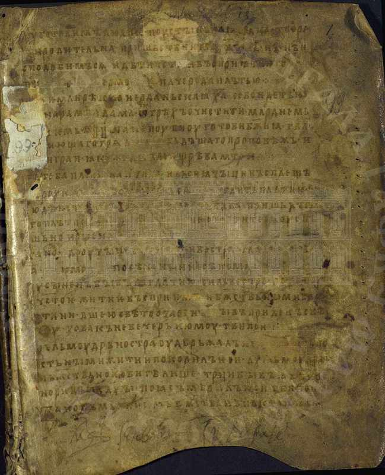 | 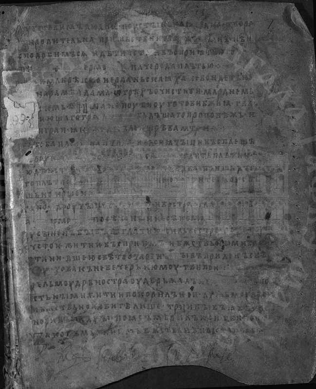 | 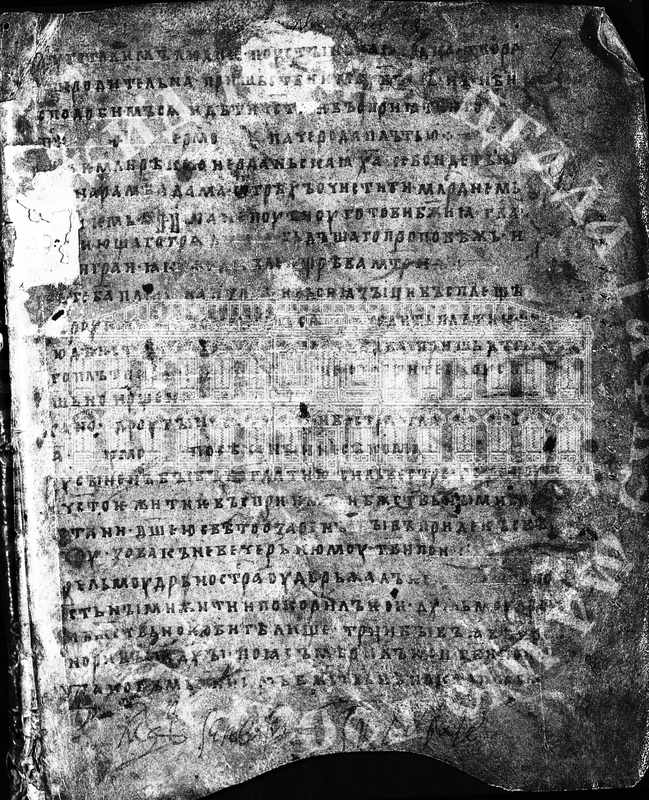 |

| Гистограммы яркости | LBP до | LBP после |
|:-------------------:|:------:|:---------:|
| 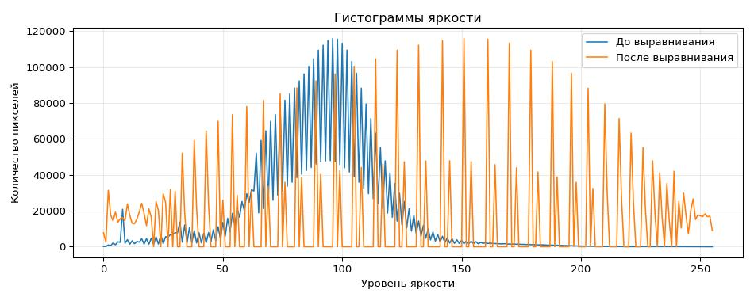 | 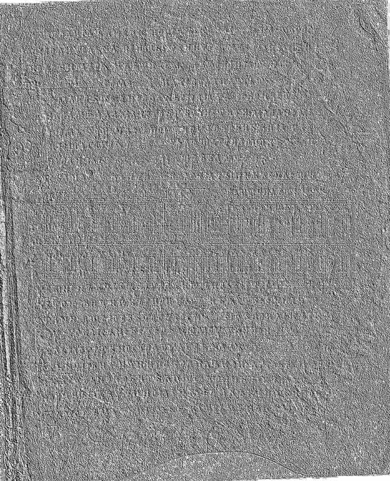 | 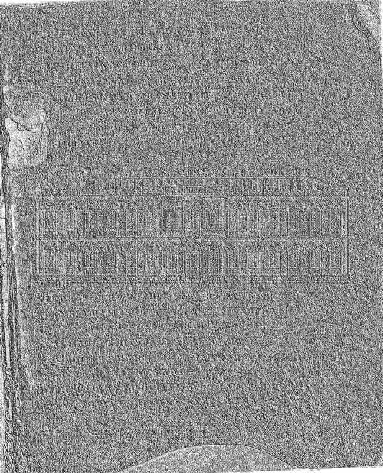 |

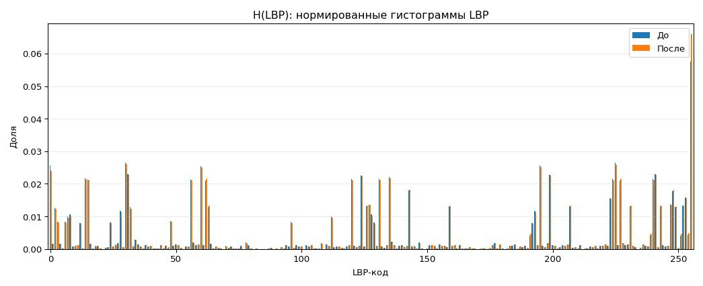

| Показатель | Значение |
|:-----------|---------:|
| Энтропия H(LBP) до | `6.346826` |
| Энтропия H(LBP) после | `6.332540` |
| Евклидово расстояние | `0.009063` |
| L1-расстояние | `0.031229` |
| Косинусное сходство | `0.997945` |
| CSV | `src_variant11/img1_lbp_histograms.csv` |

#### Изображение 2

| Исходное | Полутоновое | После выравнивания |
|:--------:|:-----------:|:-------------------:|
| 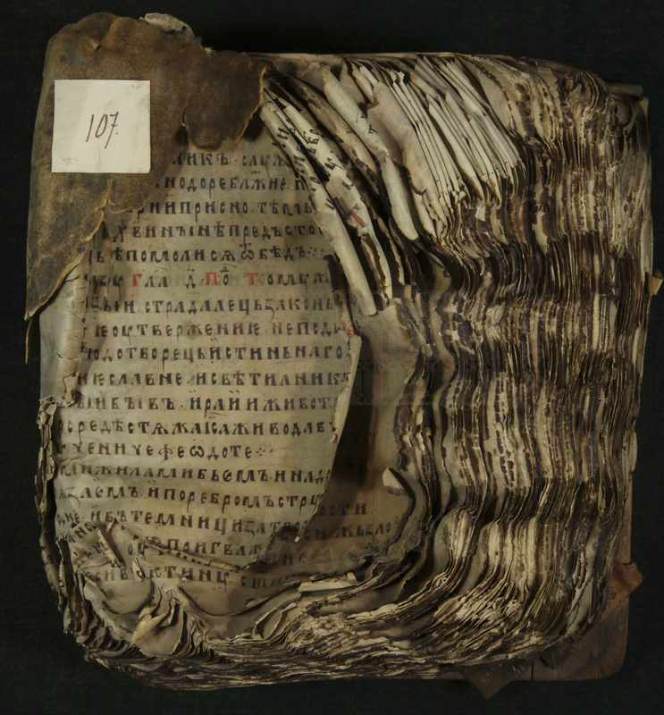 | 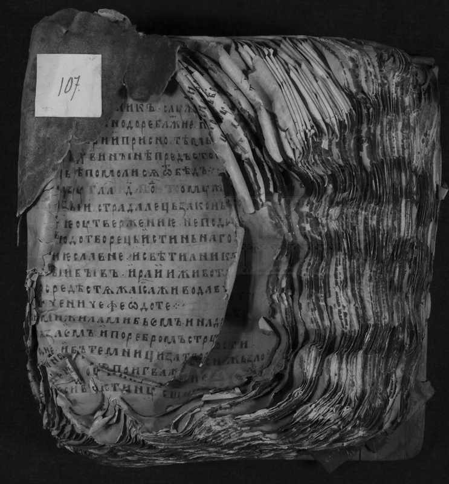 | 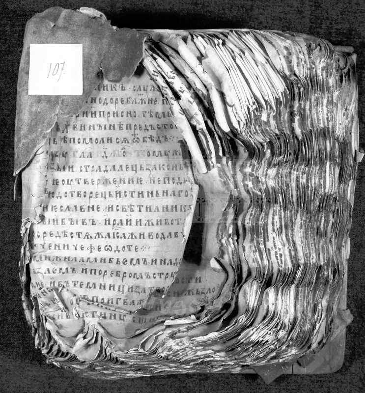 |

| Гистограммы яркости | LBP до | LBP после |
|:-------------------:|:------:|:---------:|
| 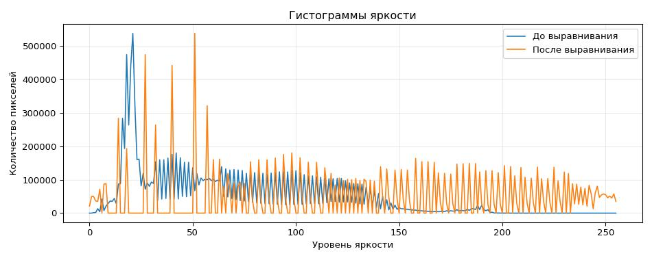 | 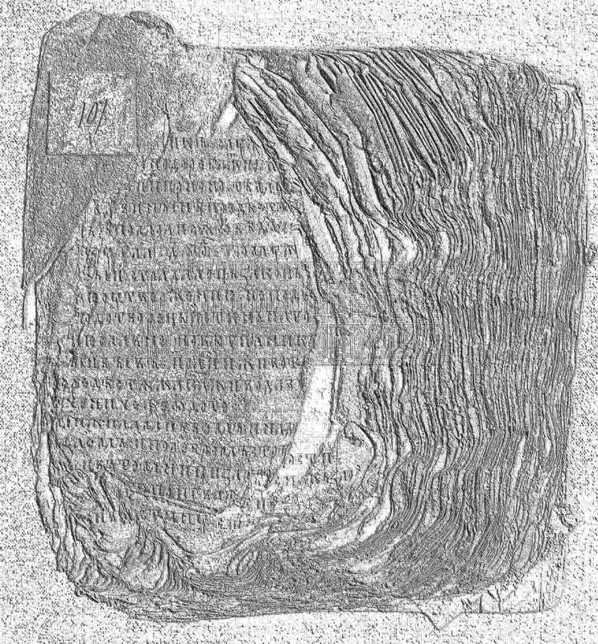 | 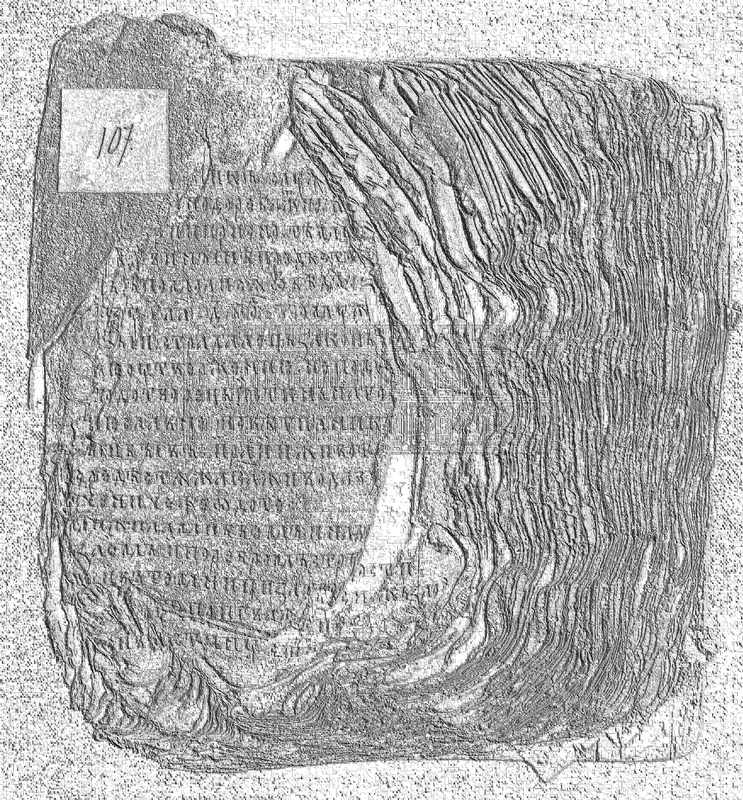 |

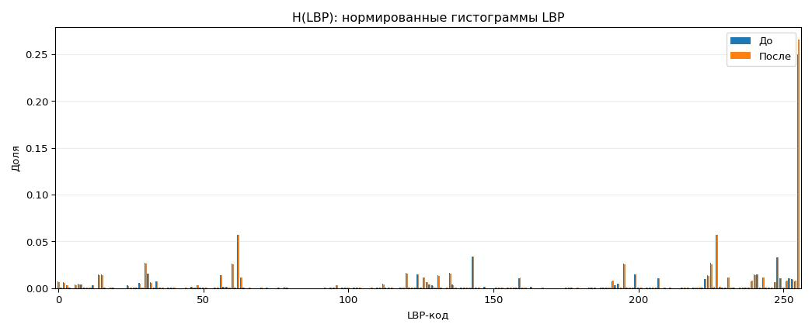

| Показатель | Значение |
|:-----------|---------:|
| Энтропия H(LBP) до | `5.175966` |
| Энтропия H(LBP) после | `5.105400` |
| Евклидово расстояние | `0.015922` |
| L1-расстояние | `0.041147` |
| Косинусное сходство | `0.999479` |
| CSV | `src_variant11/img2_lbp_histograms.csv` |

#### Изображение 3

| Исходное | Полутоновое | После выравнивания |
|:--------:|:-----------:|:-------------------:|
| 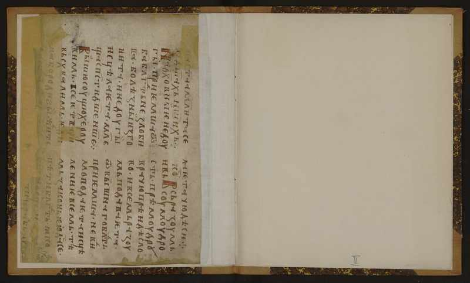 | 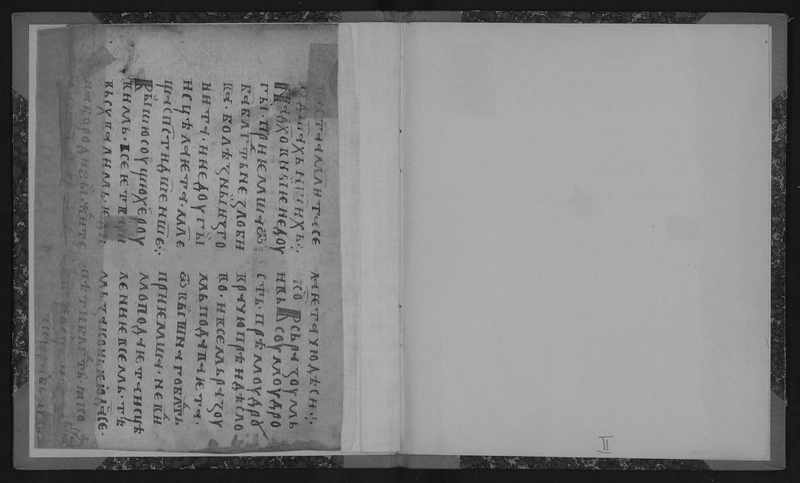 | 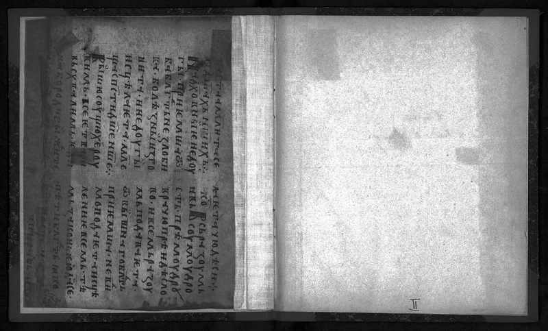 |

| Гистограммы яркости | LBP до | LBP после |
|:-------------------:|:------:|:---------:|
| 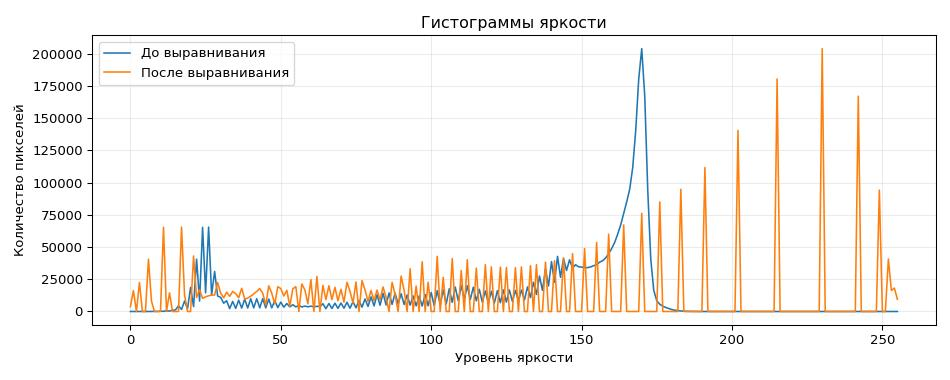 | 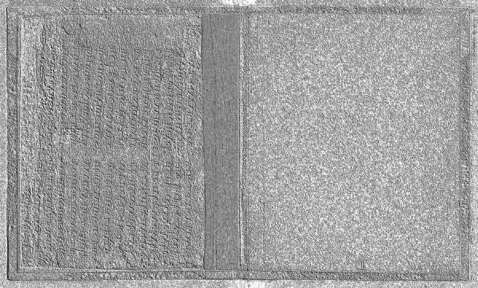 | 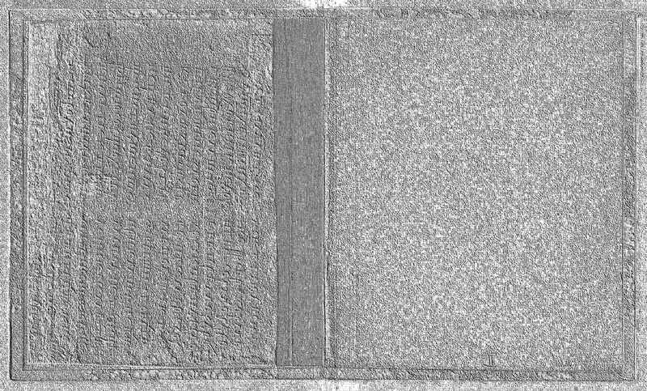 |

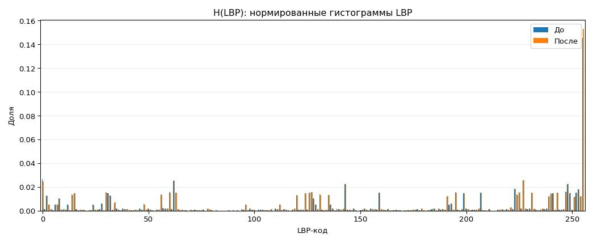

| Показатель | Значение |
|:-----------|---------:|
| Энтропия H(LBP) до | `6.203089` |
| Энтропия H(LBP) после | `6.167131` |
| Евклидово расстояние | `0.008380` |
| L1-расстояние | `0.028013` |
| Косинусное сходство | `0.999482` |
| CSV | `src_variant11/img3_lbp_histograms.csv` |

### Сводная таблица

| № | Размер | Entropy до | Entropy после | Euclid | L1 | Cos |
|:-:|:------:|-----------:|--------------:|-------:|---:|----:|
| 1 | 1877x2314 | 6.346826 | 6.332540 | 0.009063 | 0.031229 | 0.997945 |
| 2 | 3500x3770 | 5.175966 | 5.105400 | 0.015922 | 0.041147 | 0.999479 |
| 3 | 2400x1450 | 6.203089 | 6.167131 | 0.008380 | 0.028013 | 0.999482 |

Сводные файлы: `src_variant11/summary.csv`, `src_variant11/summary.json`.
